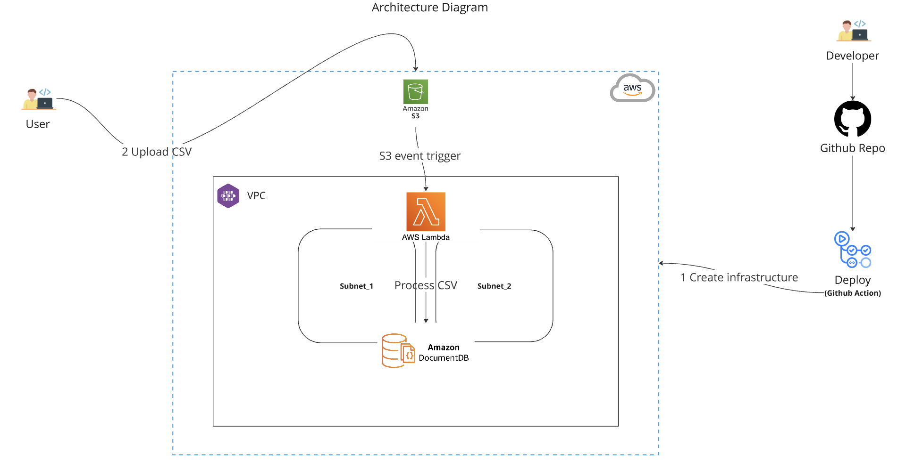

# Challenge

# High Level Architecture Diagram


# Overview
This architecture outlines the deployment of a system that allows uploading student data files to an S3 bucket, processing these files using AWS Lambda, and storing the data in Amazon DocumentDB. The setup ensures automation, scalability, high availability, and security.

# Components
## AWS Services
 ### S3 (Simple Storage Service)
-   Stores the uploaded student data files.
### Lambda

- Processes the uploaded CSV files and updates the Amazon DocumentDB database.
### Amazon DocumentDB

- Stores the student data, accessible via MongoDB tools.
### IAM (Identity and Access Management)

  Controls access to AWS resources.
### GitHub Actions Workflows
- Build

  - Builds the Lambda function package and infrastructure scripts.
- Test

  - Runs tests to ensure code quality and functionality.
- Deploy

  - Deploys the infrastructure and Lambda function to AWS.
### Networking
- VPC (Virtual Private Cloud)

  - Contains all AWS resources, segmented into public and private subnets.
- Security Groups and NACLs

    - Manages network access to DocumentDB and other services.
## Data Flow
1. File Upload

   -  Users upload student data files to an S3 bucket.
2. Event Trigger

   - S3 triggers a Lambda function upon file upload.
3. Data Processing

   - The Lambda function processes the CSV file, transforming and updating the data in Amazon DocumentDB.
4. Data Storage

   - The processed data is stored in Amazon DocumentDB, accessible via MongoDB tools.


## Project Directories
- /iac/
  - Contains the infrastructure as code scripts for deploying the AWS resources.Contains all Terraform files necessary for provisioning and managing infrastructure across various environments. Separate directories for each environment allow for specific configurations and variable values per environment.

## Instructions to Deploy

1. Clone the repository:

```bash
git clone
```

2. Navigate to the project directory:

```bash
cd n-challenge
```

3. Set up the AWS credentials:

```bash
export AWS
```

4. Deploy the infrastructure:

```bash
cd iac
terraform init
terraform apply
``` 
5. Upload a student data file to the S3 bucket.
6. Verify the data in Amazon DocumentDB.
7. Clean up the resources:

```bash
terraform destroy
```
